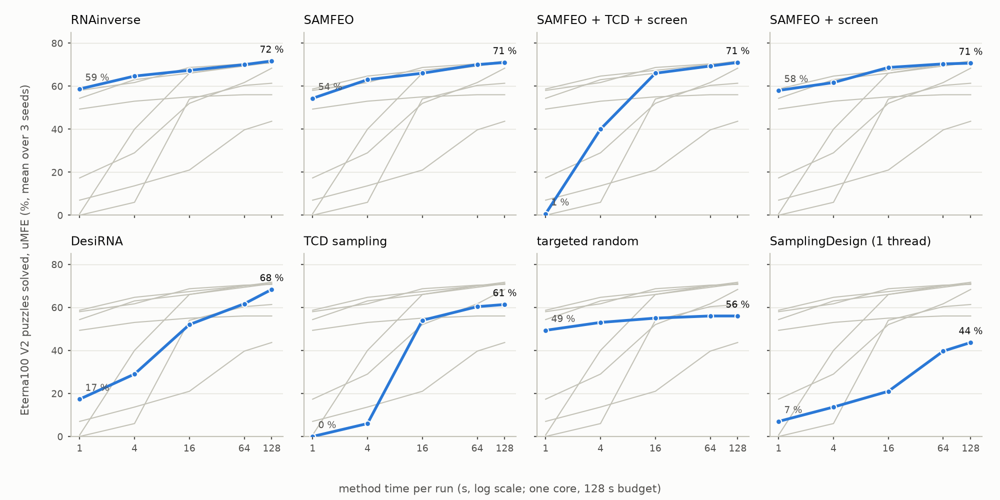

# RiboMamba

**Structure-conditioned RNA design: search quality, inference cost, and a null benchmark result.**

[Technical report](docs/REPORT_repair_v2.md) · [Results](docs/results/README.md) · [Reproduction](docs/REPRODUCE.md) · [Documentation](docs/README.md)

RiboMamba studies whether a small masked-diffusion model can improve RNA inverse folding: finding a sequence that folds into a requested secondary structure. A target-conditioned Transformer proposes sequence repairs inside SAMFEO; an energy screen selects candidates before expensive folding evaluations.

The completed study found **no success-rate improvement over SAMFEO** at the tested budget. Conditioned proposals improved ensemble quality. A separate development study reduced proposal overhead with CUDA graphs, but the optimized method still solved fewer puzzles than the non-neural energy screen.

The name comes from an earlier Transformer/BiMamba study. The final repair experiments use a Transformer backbone.

## Results

Eterna100 V2, all 100 targets, three seeds, 128 seconds of method time per run on one CPU core. Neural methods additionally share one RTX 4060 Laptop GPU. These are time-budget comparisons, not equal-hardware comparisons. Success requires the target to be the unique minimum-free-energy structure under ViennaRNA 2.7.2 / Turner 2004.

| Method | Solved, mean over seeds / 100 | Solved by any seed / 100 |
| :--- | ---: | ---: |
| RNAinverse | 71.7 | 75 |
| SAMFEO | 71.0 | 74 |
| SAMFEO + conditioned proposals + energy screen | 71.0 | 73 |
| SAMFEO + energy screen | 70.7 | 73 |
| DesiRNA | 68.3 | 74 |
| Conditioned diffusion sampling | 61.3 | 62 |
| Targeted random sampling | 56.0 | 56 |
| SamplingDesign, one thread | 43.7 | 48 |



*Mean success across three seeds. The short, one-core budget differs from published baseline settings; SamplingDesign is especially constrained by the single-thread setting.*

- **Primary endpoint:** conditioned proposals plus the screen versus SAMFEO: 0.0 percentage points, paired 95% bootstrap interval [−3.7, +3.7]. This is a null result, not proof of equivalence.
- **Ensemble quality:** mean best normalized ensemble defect was 0.0400 versus 0.0459 for SAMFEO; paired difference −0.0059 [−0.0085, −0.0035]. Lower is better. This is a secondary endpoint; comparisons are not multiplicity-adjusted.
- **Inference efficiency:** CUDA-graph replay reduced proposal overhead by 2.48× in four concurrent cold runs. Isolated cold runs gained 1.51×. These development measurements are specific to the tested laptop/WSL2 configuration.

The [report](docs/REPORT_repair_v2.md) includes the complete protocol, uncertainty, negative results, execution corrections, and limitations. No novelty, state-of-the-art, or biological-function claim is made. The research direction is closed.

## What is implemented

- A resumable design harness with per-candidate traces, resource counters, deadline handling, and validation of saved units.
- Adapters for SAMFEO, RNAinverse, DesiRNA, and SamplingDesign.
- Energy-screened search, learned critics, and a structure-conditioned masked-diffusion denoiser.
- Eager and CUDA-graph proposal paths, with tests of their equivalence on the measured configuration.
- Dataset preparation, leakage auditing, target manifests, and analysis scripts.

```text
ribomamba/design/     Search, baseline adapters, scoring, and experiment runner
ribomamba/models/     Transformer, conditioned denoiser, and historical backbones
ribomamba/eval/       Folding metrics and statistical analysis
scripts/             Training, evaluation, profiling, and report generation
manifests/           Versioned target membership and split records
tests/               Unit and integration tests
docs/                Report, reproduction guide, and research records
```

## Inspect the results

The report, figures, and [aggregate result snapshot](docs/results/README.md) are available in a fresh clone. Reading them requires no GPU, checkpoint, or data download.

```bash
git clone https://github.com/Chikap1009/RiboMamba.git
cd RiboMamba
python -m json.tool docs/results/final_v2_summary.json > /dev/null
```

To redraw the figures, use an environment with matplotlib installed:

```bash
python scripts/final_figures.py   --report docs/results/final_v2_summary.json   --out-dir /tmp/ribomamba-figures
```

For experiments, follow the [reproduction guide](docs/REPRODUCE.md) and the pinned `environment.design_v2.*.lock.yml` files. Raw traces, training data, checkpoints, and external baseline checkouts are **not distributed in this repository**. The aggregate snapshot supports inspection and figure rendering; it does not replace those assets for independent recomputation or model execution.

## Validation and provenance

The closeout validated 3,504 final benchmark units and 384 efficiency-study units. The focused local integration suite passed 54 tests on the recorded GPU configuration. GitHub CI runs a smaller CPU-only tokenizer/statistics suite; it does not reproduce the benchmark.

Methods and endpoints were prespecified in a locally frozen [protocol](docs/PROTOCOL_design_v2.md). [Model](docs/MODEL_CARD_tcd_v1.md) and [data](docs/DATA_CARD_design.md) cards describe provenance and limitations. [Project history](docs/PROJECT_HISTORY.md) records decisions, corrections, and AI-assisted implementation.

## Availability

This is research code accompanying a completed technical report. Third-party baselines must be obtained separately; their revisions are recorded in the reproduction guide. This repository does not currently grant a project-wide open-source license. Public visibility alone should not be interpreted as a redistribution grant.
